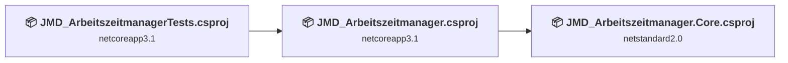
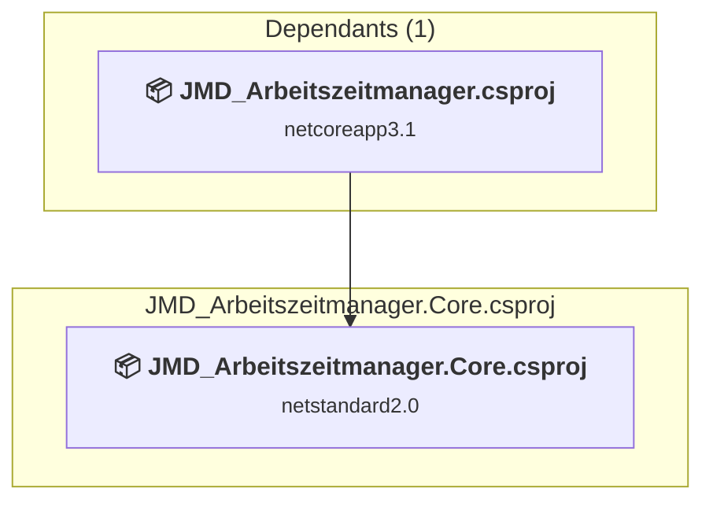
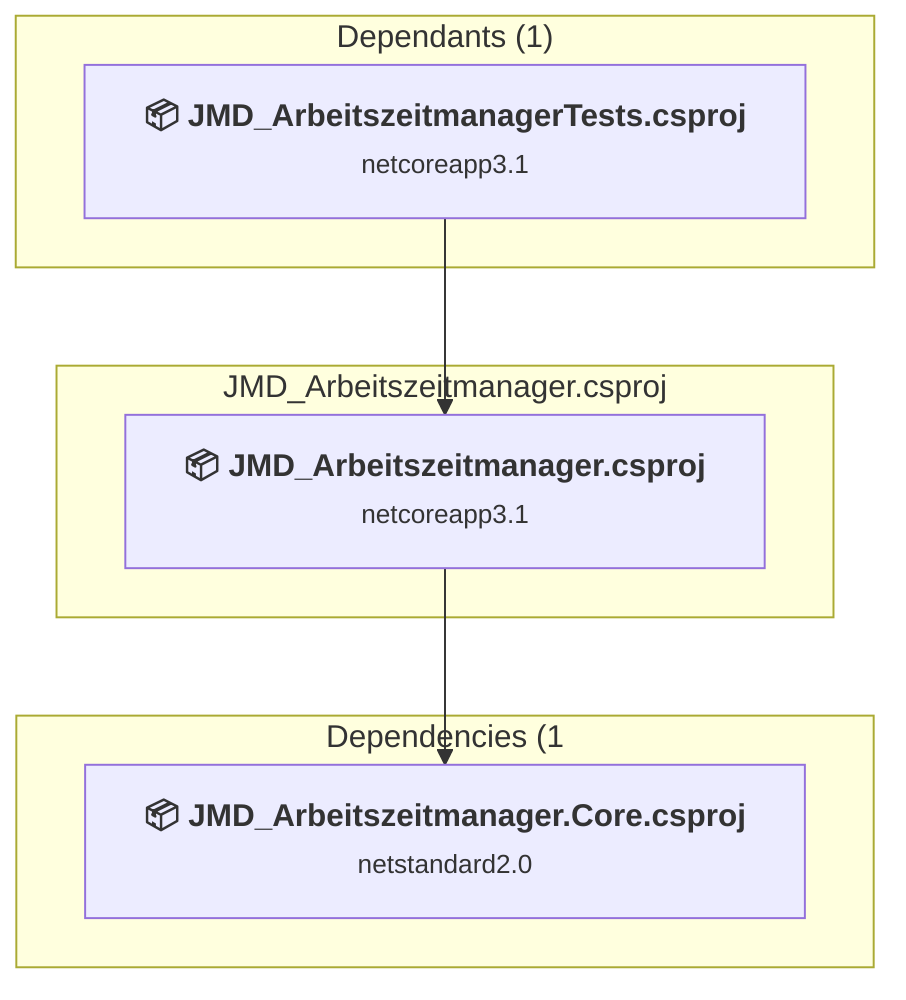
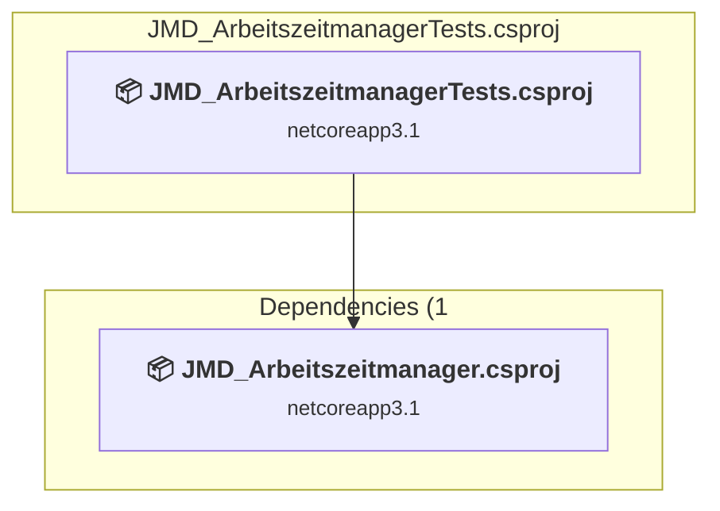

# Projects and dependencies analysis

This document provides a comprehensive overview of the projects and their dependencies in the context of upgrading to .NETCoreApp,Version=v10.0.

## Table of Contents

- [Executive Summary](#executive-Summary)
  - [Highlevel Metrics](#highlevel-metrics)
  - [Projects Compatibility](#projects-compatibility)
  - [Package Compatibility](#package-compatibility)
  - [API Compatibility](#api-compatibility)
- [Aggregate NuGet packages details](#aggregate-nuget-packages-details)
- [Top API Migration Challenges](#top-api-migration-challenges)
  - [Technologies and Features](#technologies-and-features)
  - [Most Frequent API Issues](#most-frequent-api-issues)
- [Projects Relationship Graph](#projects-relationship-graph)
- [Project Details](#project-details)

  - [JMD_Arbeitszeitmanager.Core\JMD_Arbeitszeitmanager.Core.csproj](#jmd_arbeitszeitmanagercorejmd_arbeitszeitmanagercorecsproj)
  - [JMD_Arbeitszeitmanager\JMD_Arbeitszeitmanager.csproj](#jmd_arbeitszeitmanagerjmd_arbeitszeitmanagercsproj)
  - [JMD_ArbeitszeitmanagerTests\JMD_ArbeitszeitmanagerTests.csproj](#jmd_arbeitszeitmanagertestsjmd_arbeitszeitmanagertestscsproj)

## Executive Summary

### Highlevel Metrics

| Metric | Count | Status |
| :--- | :---: | :--- |
| Total Projects | 3 | All require upgrade |
| Total NuGet Packages | 9 | 2 need upgrade |
| Total Code Files | 51 |  |
| Total Code Files with Incidents | 3 |  |
| Total Lines of Code | 3618 |  |
| Total Number of Issues | 6 |  |
| Estimated LOC to modify | 0+ | at least 0,0% of codebase |

### Projects Compatibility

| Project | Target Framework | Difficulty | Package Issues | API Issues | Est. LOC Impact | Description |
| :--- | :---: | :---: | :---: | :---: | :---: | :--- |
| [JMD_Arbeitszeitmanager.Core\JMD_Arbeitszeitmanager.Core.csproj](#jmd_arbeitszeitmanagercorejmd_arbeitszeitmanagercorecsproj) | netstandard2.0 | 🟢 Low | 2 | 0 |  | ClassLibrary, Sdk Style = True |
| [JMD_Arbeitszeitmanager\JMD_Arbeitszeitmanager.csproj](#jmd_arbeitszeitmanagerjmd_arbeitszeitmanagercsproj) | netcoreapp3.1 | 🟢 Low | 2 | 0 |  | Wpf, Sdk Style = True |
| [JMD_ArbeitszeitmanagerTests\JMD_ArbeitszeitmanagerTests.csproj](#jmd_arbeitszeitmanagertestsjmd_arbeitszeitmanagertestscsproj) | netcoreapp3.1 | 🟢 Low | 0 | 0 |  | DotNetCoreApp, Sdk Style = True |

### Package Compatibility

| Status | Count | Percentage |
| :--- | :---: | :---: |
| ✅ Compatible | 7 | 77,8% |
| ⚠️ Incompatible | 0 | 0,0% |
| 🔄 Upgrade Recommended | 2 | 22,2% |
| ***Total NuGet Packages*** | ***9*** | ***100%*** |

### API Compatibility

| Category | Count | Impact |
| :--- | :---: | :--- |
| 🔴 Binary Incompatible | 0 | High - Require code changes |
| 🟡 Source Incompatible | 0 | Medium - Needs re-compilation and potential conflicting API error fixing |
| 🔵 Behavioral change | 0 | Low - Behavioral changes that may require testing at runtime |
| ✅ Compatible | 1023 |  |
| ***Total APIs Analyzed*** | ***1023*** |  |

## Aggregate NuGet packages details

| Package | Current Version | Suggested Version | Projects | Description |
| :--- | :---: | :---: | :--- | :--- |
| coverlet.collector | 1.2.0 |  | [JMD_ArbeitszeitmanagerTests.csproj](#jmd_arbeitszeitmanagertestsjmd_arbeitszeitmanagertestscsproj) | ✅Compatible |
| MahApps.Metro | 2.4.3 |  | [JMD_Arbeitszeitmanager.csproj](#jmd_arbeitszeitmanagerjmd_arbeitszeitmanagercsproj) | ✅Compatible |
| Microsoft.Extensions.Hosting | 5.0.0 | 10.0.5 | [JMD_Arbeitszeitmanager.csproj](#jmd_arbeitszeitmanagerjmd_arbeitszeitmanagercsproj) | Ein NuGet-Paketupgrade wird empfohlen |
| Microsoft.NET.Test.Sdk | 16.5.0 |  | [JMD_ArbeitszeitmanagerTests.csproj](#jmd_arbeitszeitmanagertestsjmd_arbeitszeitmanagertestscsproj) | ✅Compatible |
| MSTest.TestAdapter | 2.1.0 |  | [JMD_ArbeitszeitmanagerTests.csproj](#jmd_arbeitszeitmanagertestsjmd_arbeitszeitmanagertestscsproj) | ✅Compatible |
| MSTest.TestFramework | 2.1.0 |  | [JMD_ArbeitszeitmanagerTests.csproj](#jmd_arbeitszeitmanagertestsjmd_arbeitszeitmanagertestscsproj) | ✅Compatible |
| MySql.Data | 8.0.23 |  | [JMD_Arbeitszeitmanager.csproj](#jmd_arbeitszeitmanagerjmd_arbeitszeitmanagercsproj) | ✅Compatible |
| NETStandard.Library | 2.0.3 |  | [JMD_Arbeitszeitmanager.Core.csproj](#jmd_arbeitszeitmanagercorejmd_arbeitszeitmanagercorecsproj) | ✅Compatible |
| Newtonsoft.Json | 12.0.3 | 13.0.4 | [JMD_Arbeitszeitmanager.Core.csproj](#jmd_arbeitszeitmanagercorejmd_arbeitszeitmanagercorecsproj) | Ein NuGet-Paketupgrade wird empfohlen |

## Top API Migration Challenges

### Technologies and Features

| Technology | Issues | Percentage | Migration Path |
| :--- | :---: | :---: | :--- |

### Most Frequent API Issues

| API | Count | Percentage | Category |
| :--- | :---: | :---: | :--- |

## Projects Relationship Graph

Legend:
📦 SDK-style project
⚙️ Classic project

## Project Details

### JMD_Arbeitszeitmanager.Core\JMD_Arbeitszeitmanager.Core.csproj

#### Project Info

- **Current Target Framework:** netstandard2.0✅
- **SDK-style**: True
- **Project Kind:** ClassLibrary
- **Dependencies**: 0
- **Dependants**: 1
- **Number of Files**: 7
- **Number of Files with Incidents**: 1
- **Lines of Code**: 202
- **Estimated LOC to modify**: 0+ (at least 0,0% of the project)

#### Dependency Graph

Legend:
📦 SDK-style project
⚙️ Classic project

### API Compatibility

| Category | Count | Impact |
| :--- | :---: | :--- |
| 🔴 Binary Incompatible | 0 | High - Require code changes |
| 🟡 Source Incompatible | 0 | Medium - Needs re-compilation and potential conflicting API error fixing |
| 🔵 Behavioral change | 0 | Low - Behavioral changes that may require testing at runtime |
| ✅ Compatible | 326 |  |
| ***Total APIs Analyzed*** | ***326*** |  |

### JMD_Arbeitszeitmanager\JMD_Arbeitszeitmanager.csproj

#### Project Info

- **Current Target Framework:** netcoreapp3.1
- **Proposed Target Framework:** net10.0-windows
- **SDK-style**: True
- **Project Kind:** Wpf
- **Dependencies**: 1
- **Dependants**: 1
- **Number of Files**: 45
- **Number of Files with Incidents**: 1
- **Lines of Code**: 3227
- **Estimated LOC to modify**: 0+ (at least 0,0% of the project)

#### Dependency Graph

Legend:
📦 SDK-style project
⚙️ Classic project

### API Compatibility

| Category | Count | Impact |
| :--- | :---: | :--- |
| 🔴 Binary Incompatible | 0 | High - Require code changes |
| 🟡 Source Incompatible | 0 | Medium - Needs re-compilation and potential conflicting API error fixing |
| 🔵 Behavioral change | 0 | Low - Behavioral changes that may require testing at runtime |
| ✅ Compatible | 0 |  |
| ***Total APIs Analyzed*** | ***0*** |  |

### JMD_ArbeitszeitmanagerTests\JMD_ArbeitszeitmanagerTests.csproj

#### Project Info

- **Current Target Framework:** netcoreapp3.1
- **Proposed Target Framework:** net10.0
- **SDK-style**: True
- **Project Kind:** DotNetCoreApp
- **Dependencies**: 1
- **Dependants**: 0
- **Number of Files**: 6
- **Number of Files with Incidents**: 1
- **Lines of Code**: 189
- **Estimated LOC to modify**: 0+ (at least 0,0% of the project)

#### Dependency Graph

Legend:
📦 SDK-style project
⚙️ Classic project

### API Compatibility

| Category | Count | Impact |
| :--- | :---: | :--- |
| 🔴 Binary Incompatible | 0 | High - Require code changes |
| 🟡 Source Incompatible | 0 | Medium - Needs re-compilation and potential conflicting API error fixing |
| 🔵 Behavioral change | 0 | Low - Behavioral changes that may require testing at runtime |
| ✅ Compatible | 697 |  |
| ***Total APIs Analyzed*** | ***697*** |  |

